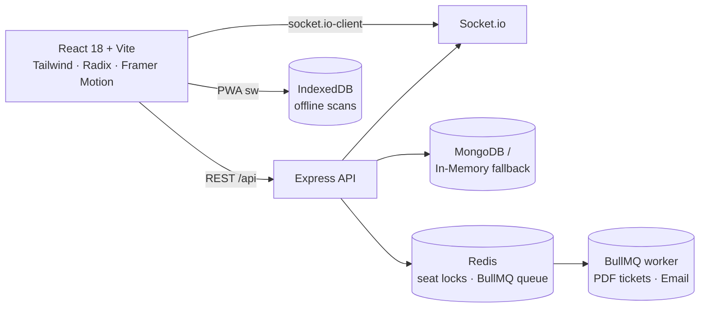

# EMS Platform


> **Zero-overbooking ticketing, offline-first gate check-in, and live event operations — in one polished app.**

<p align="center">
  
  
  
  
  
  
  
</p>

**Who it's for** — attendees who want a beautiful booking experience, gate staff who need a scanner that never fails, and organizers who want live crowd intelligence.

**Why it's different** — the same system that sells tickets **can never oversell**: capacity is enforced atomically (`$expr`), check-in keeps working with **no internet**, and every gate scan syncs back automatically.

---

## Table of Contents

- [Why EMS](#why-ems)
- [Features](#features)
- [Architecture](#architecture)
- [Quick Start](#quick-start)
  - [Option A — Full stack with Docker](#option-a--full-stack-with-docker-recommended)
  - [Option B — Zero-dependency fallback mode](#option-b--zero-dependency-fallback-mode-no-mongoredis)
- [Demo Accounts](#demo-accounts)
- [API Overview](#api-overview)
- [Configuration](#configuration)
- [Project Structure](#project-structure)
- [Contributing](#contributing)
- [License](#license)

---

## Why EMS

- **✓ Zero overbooking, guaranteed.** `soldTickets < capacity` is enforced in a single atomic Mongo `$expr` update behind a Redis distributed lock — concurrent buyers can't race the last seat.
- **✓ Check-in that works offline.** Scans queue in IndexedDB and auto-sync when the network returns. Gate lines never stop for a dead connection.
- **✓ Live by default.** Socket.io pushes every check-in to organizer dashboards in real time — attendee counters update as people walk through the door.
- **✓ Runs anywhere.** Point a `MONGO_URI` at MongoDB, or start with zero infrastructure — the API falls back to an in-memory database with seeded demo data.

## Features

| Area | What you get |
|------|--------------|
| 🎟 Ticketing | Unique hashed QR tickets per seat, registration endpoint, "seats left" urgency, sold-out states |
| 📱 Attendee app | Discovery search, event detail with agenda preview, wallet-style passes, add-to-calendar, offline ticket cache |
| 🚪 Gate check-in | High-contrast operator scanner, status tones (granted / duplicate / denied), audit trail, offline queue + sync |
| 📊 Organizer dashboard | Bento stat grid, live attendance via websocket, create events, export attendee roster CSV |
| 🗓 Agenda & sessions | Multi-track schedules, per-session registration and room/speaker metadata |
| 🤝 Lead capture CRM | Scan attendees into hot/warm/cold scored leads, inline notes, CSV export |
| 🤖 AI concierge | In-app chat assistant that answers event, session, and ticket questions |
| ⚡ Performance | Rate limiting, Helmet, lazy-chunked frontend (manualChunks), PWA service worker |

## Architecture



**Backend** (`node/express`) — JWT auth, Mongoose models (`User`, `Event`, `Ticket`, `Session`, `Lead`), Redis `NX` seat locks with Lua-script release, BullMQ for async PDF/email, Socket.io rooms per event, Zod validation, Helmet + rate limiting.

**Frontend** (`react/vite`) — tokenized dark-first design system, offline-first PWA, QR passes via `qrcode.react`, real-time dashboards, ⌘K command palette, AI concierge widget.

## Quick Start

### Prerequisites

- **Node.js 18+**
- **Docker & Docker Compose** *(only for Option A)*

### Option A — Full stack with Docker (recommended)

```bash
# 1. Infrastructure (MongoDB + Redis)
docker-compose up -d

# 2. Backend
cd backend
cp .env.example .env          # then edit secrets
npm install && npm run dev    # → http://localhost:5000

# 3. Frontend
cd ../frontend
npm install && npm run dev    # → http://localhost:3000
```

### Option B — Zero-dependency fallback mode (no Mongo/Redis)

The API detects unconfigured infrastructure and switches to an **in-memory database with seeded demo data**. Redis-dependant locks and the BullMQ queue are skipped safely, so every core flow still works:

```bash
cd backend && npm install && npm run dev
cd ../frontend && npm install && npm run dev
```

> The frontend proxies `/api` and `/socket.io` to port `5000` — no CORS config in dev.

### Production build

```bash
cd frontend && npm ci && npm run build   # outputs frontend/dist (works/).
cd backend && npm ci --omit=dev && npm start
```

## Demo Accounts

| Role | Email | Password |
|------|-------|----------|
| Organizer | `organizer@ems.local` | `password123` |
| Attendee | `attendee@ems.local` | `password123` |

Seed events (`AI & Future of Tech Summit 2026`, `Global Electronic Music Festival`) are preloaded in fallback mode. One-click demo sign-in buttons are on the login page.

## API Overview

| Method | Endpoint | Access | Purpose |
|--------|----------|--------|---------|
| POST | `/api/auth/register` · `/api/auth/login` | Public | Accounts & JWT |
| GET | `/api/events` · `/api/events/:id` | Public | Event discovery |
| POST | `/api/events` | Org/Admin | Create events |
| POST | `/api/tickets/events/:id/register` | Attendee+ | Atomic seat booking → QR ticket |
| GET | `/api/tickets/my-tickets` | Auth | Hydrated digital tickets |
| POST | `/api/check-in/scan` | Auth | Validate QR → check-in (offline-safe) |
| GET | `/api/check-in/events/:id/stats` | Org/Admin | Live attendance stats |
| GET | `/api/check-in/events/:id/attendees/csv` | Org/Admin | Roster export |
| GET | `/api/sessions/event/:id` | Public | Event agenda |
| GET/POST/PUT | `/api/leads*` · `/api/leads/capture` · `/api/leads/export` | Exhibitor+ | Lead CRM |
| POST | `/api/ai/chat` | Public | AI concierge |

## Configuration

| Variable | Default | Notes |
|----------|---------|-------|
| `PORT` | `5000` | API port |
| `MONGO_URI` | `mongodb://localhost:27017/ems_db` | Unset/unreachable → in-memory mode |
| `REDIS_URL` | `redis://localhost:6379` | Redundant in fallback mode |
| `JWT_SECRET` | `fallback_secret_key` | **Set a strong secret in production** |
| `SMTP_HOST` · `SMTP_PORT` | ethereal test account | Used by the ticket PDF/email queue |

## Project Structure

```
EMS/
├── backend/                  # Express API · Mongo · Redis · BullMQ · Socket.io
│   ├── src/controllers/      # auth, events, tickets, check-in, leads, sessions, ai
│   ├── src/models/           # Mongoose schemas + in-memory fallback adapters
│   ├── src/routes/           # REST route tables
│   ├── src/config/           # db, redis, memory-db (zero-infra fallback)
│   ├── src/queues/           # BullMQ PDF + email worker
│   └── src/sockets/          # Socket.io room/check-in manager
├── frontend/                 # React 18 + Vite · PWA · offline scanner
│   ├── src/components/ui/    # Radix + CVA design-system primitives
│   ├── src/pages/            # Home, EventDetail, MyTickets, GateScanner, …
│   ├── src/lib/              # api client, socket client, helpers
│   └── public/               # sw.js, manifest.json, favicon
└── docker-compose.yml        # MongoDB 6 + Redis 7
```

## Contributing

1. Fork the repo and create a branch: `git checkout -b feature/your-feature`
2. Run the API in **Option B** mode, then the frontend dev server — a working Quick Start is the first priority.
3. Open a PR with a description of the change and a short manual test note.

Verified flow to keep green: login → register → QR ticket → `/api/check-in/scan` (success + duplicate rejection) → stats posture, all pass against the in-memory backend.

## License

Distributed for evaluation and personal use. A formal open-source license will be published with the first public release — reach out to the maintainers before reuse or redistribution.